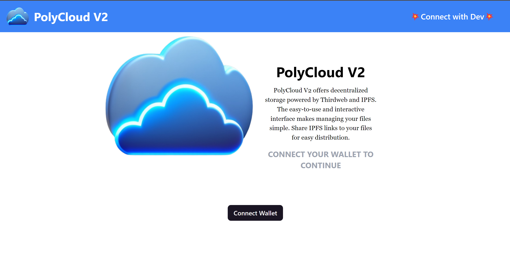
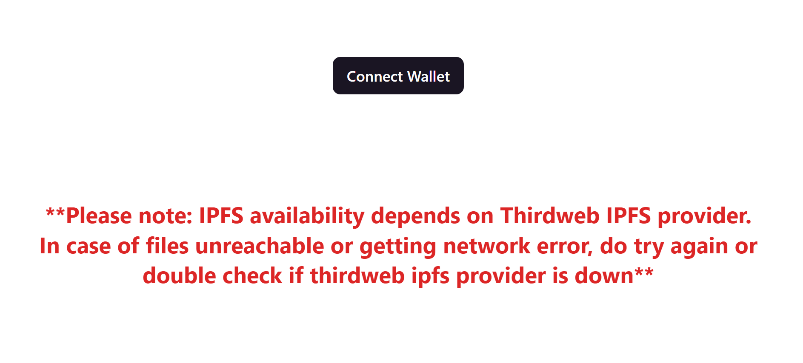
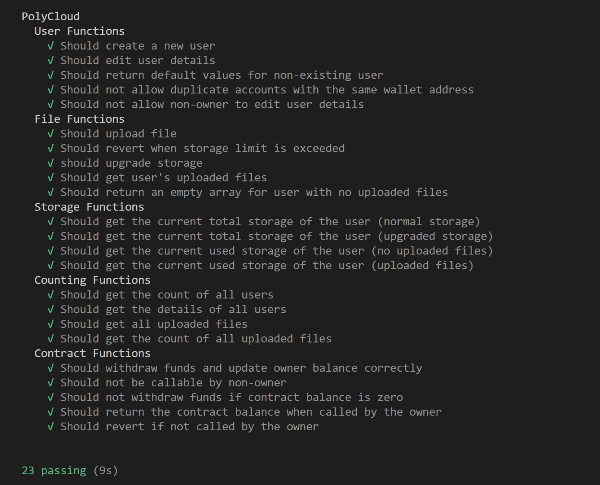
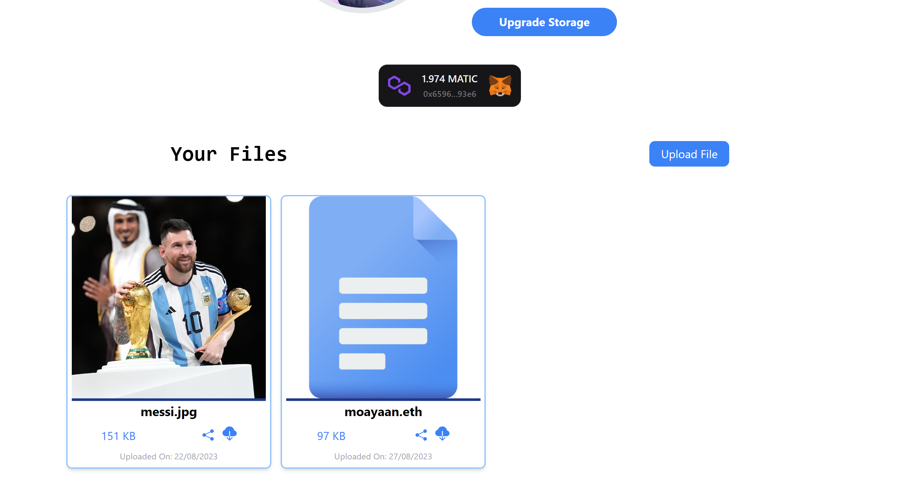
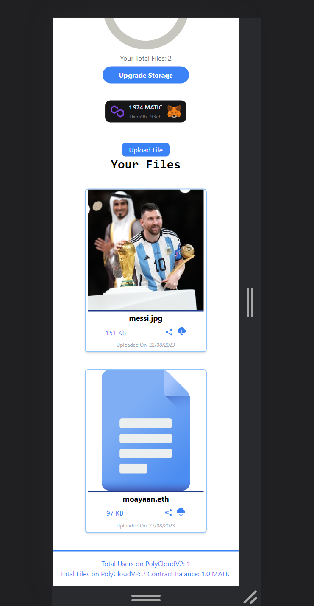

# Polycloud v2

### Video Demo Link: [Add link](https://example.com)

### Deployed Link: [Add link](https://example.com) 

## Description

Polycloud v2 is a decentralized storage platform built using Web3 technologies. It allows users to securely upload files and store them on IPFS/Filecoin while maintaining full control and privacy.

## Features

-📁 Drag and drop file uploading directly to IPFS

-🔐 Encrypted file storage on IPFS/Filecoin network

-🖥️ Beautiful and responsive UI for desktop and mobile

-⚙️ Integration with Metamask and other wallets

-🤝 File sharing via shareable IPFS CIDs

-⬇️ Download files directly from IPFS

-💽 Upgrade storage as per your needs

## Tech Stack

- [FULL3](https://www.npmjs.com/package/full3) - Full Stack WEB3 Starter package built on:
  - [React](https://reactjs.org/) - Frontend framework
  - [Hardhat](https://hardhat.org/) - Ethereum development environment 
  - [Solidity](https://docs.soliditylang.org/) - Smart contract language
  - [Vite](https://vitejs.dev/) - Build tool
  - [Thirdweb](https://thirdweb.com/) - Web3 development SDK
- [IPFS](https://ipfs.io/) - Decentralized storage network  
- [Polygon](https://polygon.technology/) - Ethereum sidechain

Let me know if this nested list properly expands the FULL3 bullet point!

## Smart Contract

- Written in Solidity and deployed on Polygon Mumbai testnet
- Implements core file storage logic and account management
- Fully unit tested using Hardhat framework and Chai assertions

## Preview

     

# About the Developer

Hello everyone, myself **Mohammad Ayaan Siddiqui** from India. I am a Full Stack WEB3 developer and a **DECENTRALIZATION MAXI**. Currently working as TECHNICAL CO-FOUNDER in a web3 startup based in Netherlands.

If you are interested in either of the topics or building in similar skills, connect with me below:-

1.   [My Taplink Dashboard](https://moayaan.taplink.ws/)

2.  [My Linktree with ALL SOCIALS](https://linktr.ee/ayaaneth)
3.  [Connect on Github](https://github.com/moayaan1911)
4.  [Connect on Linkedin](www.linkedin.com/in/ayaaneth)
5.  [Connect on Hashnode](https://moayaan.hashnode.dev/)
6.  [Connect on Twitter](https://www.twitter.com/usdisshitcoin)
7.  [Connect on Telegram](https://t.me/usdisshitcoin)
8.  [Connect on dev.to](https://dev.to/moayaan1911)